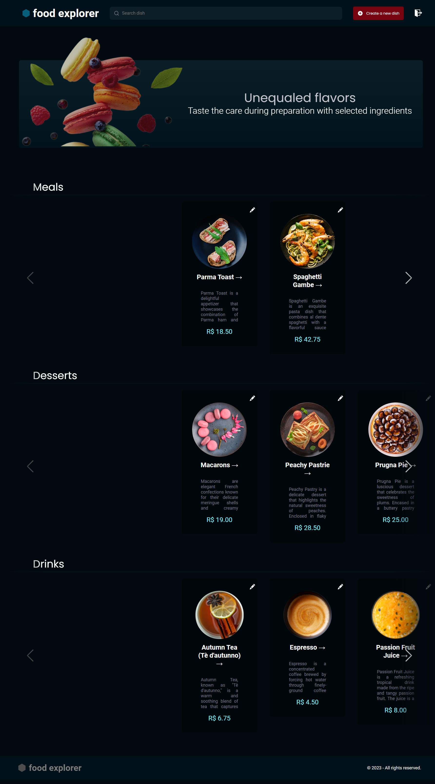

<h1 align='center'> foodExplorer - BackEnd</h1>

<p align='center'> 'foodExplorer' is a restaurant management application which allows users and owners to manage and select each dish. Users are allowed to add dishes to a buying cart and favorite preferred dishes. Administrators can create dishes and update its information. </p>


<p align='center'>
 
</p>

## 💻 Technologies

 - JavaScript
 - ReactJS
 - Node.js
 - SQLite
 - Knex Query Builder
 - Express
 - Git & GitHub
 - Figma

## 📁 Project

'foodExplorer' is a comprehensive restaurant management application. With its user-friendly interface, both diners and owners can efficiently oversee and curate their culinary experiences. Diners can effortlessly populate their shopping carts with delectable dishes while also marking their favorites for future indulgence. Meanwhile, administrators are able to create new dishes from scratch and refine existing dish information, ensuring a dynamic and up-to-date menu.


Its backend consumes its own API RESTful, which was developed with Node.JS and Express. An SQLite database is also used to store all application's data. 

You can access and experiment the project through this [link](https://benevolent-twilight-40344b.netlify.app). 


Access its Frontend [here](https://github.com/victoralva08/foodExplorer---API). 

Default admin access:

    Email: admin@gmail.com
    Password: 123456

## ❗️ Deployment

This application deployment is currently hosted with no cost by Netlify and Render cloud services. This may lead to slowness during execution.

You may also execute the application backend in a local machine by following the next commands:
```
git clone https://github.com/victoralva08/foodExplorer---API
```
``` 
$ npm install
```
``` 
$ npm run dev
```

## 📞 Contact
victor.falva08@gmail.com


